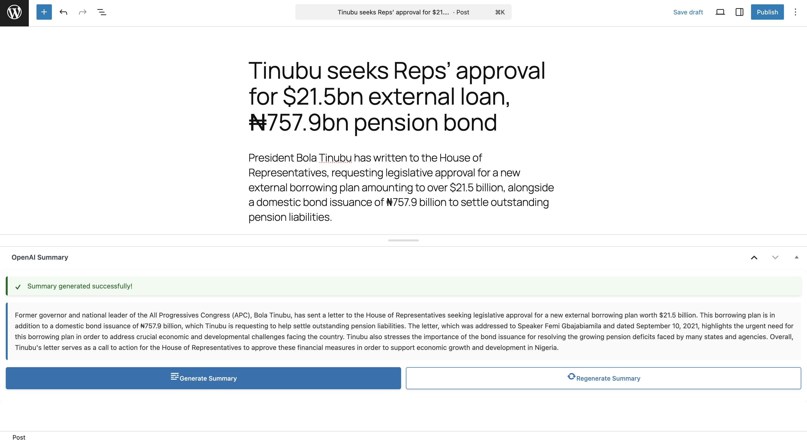

# OpenAI Automation WordPress Plugin

A powerful WordPress plugin that integrates OpenAI's API to automatically generate content summaries for your posts and pages. This plugin provides an intuitive interface within the WordPress admin area to leverage AI-powered content automation.

## 🚀 Features

- **AI-Powered Summaries**: Generate comprehensive summaries of your post content using OpenAI's GPT models
- **WordPress Integration**: Seamlessly integrates with the WordPress post editor as a meta box
- **Real-time Generation**: Generate summaries on-demand with AJAX-powered interface
- **Modern UI**: Clean, responsive interface with loading animations and notifications
- **Error Handling**: Robust error handling with user-friendly notifications
- **Content Management**: Store and manage AI-generated summaries as post metadata
- **Regeneration Support**: Easily regenerate summaries when content changes

## 📋 Requirements

- WordPress 5.0 or higher
- PHP 7.4 or higher
- OpenAI API key
- Active internet connection for API calls

## 🔧 Installation

### Manual Installation

1. Download the plugin files
2. Upload the `openai-automation` folder to your `/wp-content/plugins/` directory
3. Activate the plugin through the 'Plugins' menu in WordPress
4. Configure your OpenAI API key in the settings

### Via WordPress Admin

1. Go to `Plugins > Add New`
2. Upload the plugin zip file
3. Click 'Install Now' and then 'Activate'
4. Configure your API key in the settings

## ⚙️ Configuration

### Setting up OpenAI API Key

1. Navigate to `Settings > OpenAI Automation` in your WordPress admin
2. Enter your OpenAI API key in the provided field
3. Click 'Save Changes'

### Getting an OpenAI API Key

1. Visit [OpenAI's website](https://platform.openai.com/)
2. Create an account or log in
3. Navigate to the API section
4. Generate a new API key
5. Copy the key and paste it into the plugin settings

**⚠️ Important**: Keep your API key secure and never share it publicly. OpenAI charges for API usage based on tokens consumed.

## 📖 Usage

### Generating Summaries

1. **Create or Edit a Post**: Go to any post or page in the WordPress editor
2. **Locate the Summary Box**: Find the "OpenAI Summary" meta box in the sidebar (usually on the right)
3. **Generate Summary**: Click the "Generate Summary" button
4. **Wait for Processing**: The plugin will analyze your content and generate a summary
5. **Review Results**: The generated summary will appear in the meta box

### Managing Summaries

- **Regenerate**: Click "Regenerate Summary" to create a new summary
- **Edit Content**: Summaries are stored as post metadata and persist with your posts
- **View Status**: The interface shows loading states and success/error notifications

## 🎨 User Interface

### Meta Box Features

- **Visual Indicators**: Icons and status indicators for different states
- **Loading Animation**: Smooth animations during summary generation
- **Notification System**: Success and error messages with auto-dismiss
- **Responsive Design**: Works on desktop and mobile admin interfaces

### Button States

- **Generate Summary**: Initial button for first-time generation
- **Regenerate Summary**: Appears after initial summary creation
- **Loading State**: Disabled buttons during processing
- **Error Handling**: Clear error messages for troubleshooting

## 📸 Screenshots

Here are some screenshots illustrating the plugin's features and integration within WordPress:

- **WordPress Plugins Page**: Shows the plugin listed on the WordPress plugins page, ready for activation or management.
  

- **Plugin Settings**: Displays the dedicated settings page where users can configure their OpenAI API key.
  

- **Setting Dropdown with Plugin Settings Link Visible**: Highlights how to access the plugin settings directly from the Settings list dropdown.
  

- **WordPress Posts Page**: A general view of the WordPress posts list, showing how the plugin integrates with the overall admin interface.
  

- **WordPress Post Edit Page**: A view of the standard WordPress post edit screen.
  

- **WordPress Post Edit Page with Plugin Visible**: Shows the OpenAI Summary meta box integrated into the post edit page sidebar.
  

- **WordPress Post Edit Page Plugin Summarizing**: Illustrates the plugin in action, with a loading indicator during the summary generation process.
  

- **WordPress Post Edit Page Plugin Summarized Successful**: Displays a successfully generated summary within the meta box, along with a success notification.
  

## 🔧 Technical Details

### File Structure

```bash
openai-automation/
├── openai-automation.php   # Main plugin file
├── openai-automation.js    # Frontend JavaScript
├── openai-automation.css   # Styling
├── blog-sample.md          # Sample content
├── screenshots/            # Directory containing plugin screenshots
└── README.md               # This file
```

### API Integration

- **Model Used**: GPT-3.5-turbo-instruct (optimized for summarization)
- **Token Limit**: Up to 1000 tokens for summaries
- **Content Limit**: Handles up to 12,000 characters of input content
- **Timeout**: 60-second timeout for API requests

### WordPress Hooks

- `admin_init`: Registers plugin settings
- `admin_menu`: Adds settings page to WordPress admin
- `add_meta_boxes`: Adds summary meta box to post editor
- `admin_enqueue_scripts`: Loads CSS and JavaScript files
- `wp_ajax_generate_openai_summary`: Handles AJAX requests

## 🛠️ Customization

### Modifying the Prompt

To customize the AI prompt, edit line 118 in `openai-automation.php`:

```php
'prompt' => 'Create a comprehensive summary of the following content, capturing the main points and key details: ' . $post_content,
```

### Styling Customization

The plugin includes comprehensive CSS in `openai-automation.css`. Key classes:

- `.openai-summary-container`: Main container
- `.summary-actions`: Button container
- `.openai-notification`: Notification messages
- `.loading-state`: Loading animations

### JavaScript Customization

The `openai-automation.js` file handles:

- AJAX requests to WordPress backend
- UI animations and state management
- Error handling and notifications
- Button interactions

## 🔒 Security Features

- **Nonce Verification**: All AJAX requests include WordPress nonces
- **Input Sanitization**: User inputs are properly sanitized
- **API Key Protection**: API keys are stored securely in WordPress options
- **Error Logging**: Detailed error logging for debugging

## 🐛 Troubleshooting

### Common Issues

**"API key not set" Error**

- Ensure you've entered your OpenAI API key in Settings > OpenAI Automation
- Verify the API key is valid and active

**"Post content is empty" Error**

- Make sure your post has content before generating a summary
- Save your post draft if working with new content

**"Error connecting to OpenAI" Error**

- Check your internet connection
- Verify your API key has sufficient credits
- Ensure OpenAI services are operational

**Summary not appearing**

- Check browser console for JavaScript errors
- Verify the meta box is visible in Screen Options
- Ensure the plugin is properly activated

### Debug Mode

To enable debug logging, add this to your `wp-config.php`:

```php
define('WP_DEBUG', true);
define('WP_DEBUG_LOG', true);
```

Check `/wp-content/debug.log` for detailed error information.

## 💰 API Costs

OpenAI charges based on token usage:

- **Input tokens**: Your post content
- **Output tokens**: Generated summary
- **Typical cost**: $0.001-0.01 per summary (varies by content length)

Monitor your usage in the OpenAI dashboard to manage costs effectively.

## 🔄 Updates and Maintenance

### Version History

- **v1.0**: Initial release with core summarization features

### Planned Features

- Multiple AI model support
- Bulk summary generation
- Custom prompt templates
- Summary scheduling
- Analytics and usage tracking

## 🤝 Contributing

Contributions are welcome! Please:

1. Fork the repository
2. Create a feature branch
3. Make your changes
4. Test thoroughly
5. Submit a pull request

## 📄 License

This plugin is released under the GPL v2 or later license.

## 👨‍💻 Author

**Divine Ikhuoria**

For support, feature requests, or bug reports, please contact the author or create an issue in the project repository.

## 🙏 Acknowledgments

- OpenAI for providing the powerful API
- WordPress community for excellent documentation
- Contributors and testers

---

**Note**: This plugin requires an active OpenAI API subscription. Please review OpenAI's pricing and usage policies before implementation.
